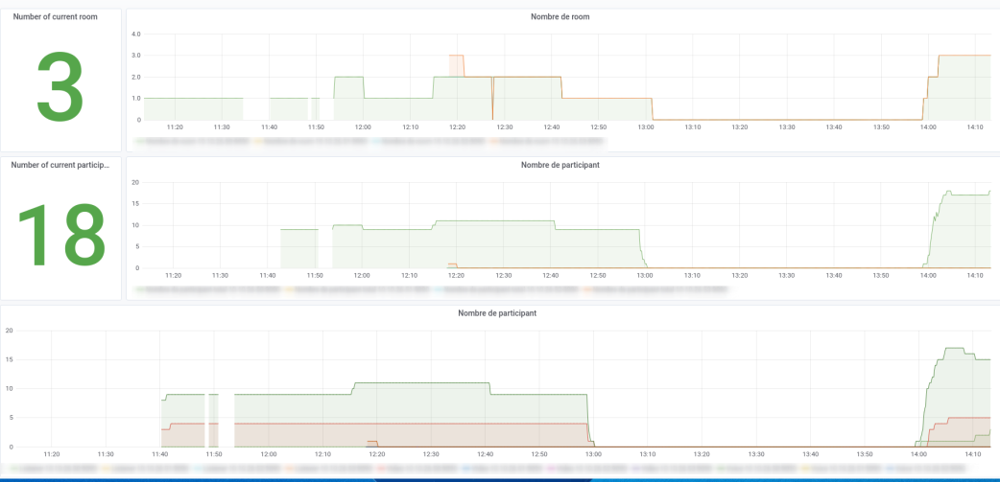

# bbb-exporter
A "Prometheus" exporter quick&amp;dirty written in bash.

This only get Number of Room currently working, Number of participant and different kind of participant (Video,Audio,ListenerOnly).

# How to run

Juste change server endpoint, secret and listening port.

For example :
```
export BBB_ENDPOINT=bbb.domain.tld
export BBB_SECRET=$(bbb-conf --secret | grep "Secret:" | awk '{print $NF}')
export LISTENING_PORT=9091

sed -i "s/BBB_ENDPOINT/$BBB_ENDPOINT/g;s/BBB_SECRET/$BBB_SECRET/g;s/LISTENING_PORT/$LISTENING_PORT/g" run.sh
```
Then you should have something like this : 

```
cat run.sh
#!/bin/bash

while true
do
  ./exporter.sh https://bbb.domain.tld SafaexYSVBCbdaefeagfpoud6OJpA351J2unBf6xE  | nc -l -p 9091
done 
```

Then you can run this script in a `screen` for example.

# Configure prometheus

You have to add an other target on the prometheus side : 
```yaml
- job_name: bbb
  honor_timestamps: true
  scrape_interval: 10s
  scrape_timeout: 10s
  metrics_path: /
  scheme: http
  static_configs:
  - targets:
    - bbb.domain.tld:9091
```

# Grafana
You can now have great dashboard like :

